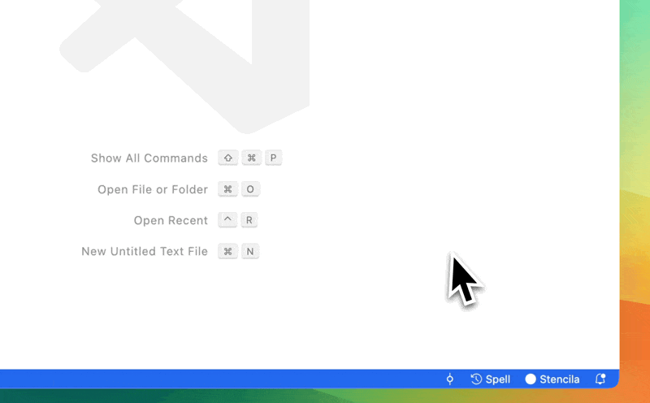

  

  <a href="#about-stencila">
    About
  </a> •
  <a href="#enabling-ai-commands">
    AI Commands
  </a> •
  <a href="#walkthroughs">
    Walkthroughs
  </a>

  
  

## About

Stencila is an open-source toolkit for enhancing **documents with scientific intelligence**. It enables users to create interactive, data-rich documents that integrate code, data, and text, supporting reproducible research and collaboration.

With Stencila’s VS Code extension, you can build smart documents that leverage AI tools, ensure transparency, and support interoperability across languages and platforms, all within your existing workflow.

## Enabling AI commands

Various back-ends can be used to enable AI assistance in Stencila documents. You must have at least one of these set up to use AI commands. Stencila will automatically select and use one of these based on the order below:

### Option 1: Stencila Cloud

**Stencila Cloud** is the easiest way to get up and running with a variety of high performance online models with just one account. You can easily select which model to use for each prompt or leave it blank and it will select the best one for you via Stencila Model Router.

To use Stencila Cloud, click **Sign In** from the Stencila extension menu, and follow the steps in your web browser to create a new account or sign into an existing account. You will receive a number of free credits to try out Stencila Cloud and after that you can sign up for a subscription plan to continue usage.

### Option 2: Use your own API keys

If you already have your own **API keys** for one of the supported LLM services, you can enter your keys in the Stencila extension menu using **Set Secret**. You will need to log into your own LLM services dashboard to retrieve your API key.

### Option 3: Use a locally running model

If you have a locally running **Ollama** model already on your computer as a background process, Stencila will automatically detect and use it. See the Ollama [website](https://ollama.com/) for more information on how to install and run it.

## Walkthroughs

The included walkthroughs cover the basics of creating structured, responsive documents, and introduce key concepts in Stencila’s syntax for adding styles, layouts, and components.

Each walkthrough includes examples and explanations, allowing users to explore and practice Stencila commands in a guided environment. Whether you're new to Stencila or looking to enhance your skills, these resources provide a practical foundation to get started with creating scientific and data-driven documents. They are updated alongside all the features within Stencila.

You can find these walkthroughs under the Stencila command menu.

